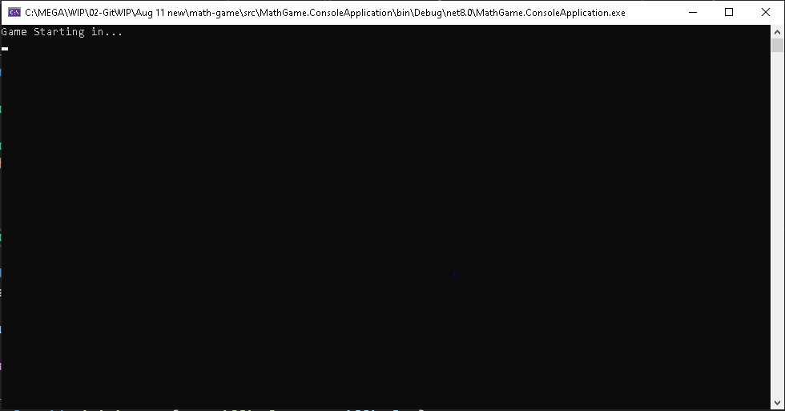

<h1> Math Game</h1>

Welcome to the Math Game App!

This demo helps young children sharpen their math skills with fun and simple math questions.  

You can choose your difficulty and number of questions. 

You can even choose a Random option if you're up for the challenge!

This is the C# Console Project #1

## Features

- **Basic Math Questions**: Addition, Subtraction, Multiplication, Division.
- **Integer-Only Division**: All division problems ensure integer results with dividends.
- **Game History**: While you can view all the history of your previous games, the data will get deleted once you've closed application.
- **Difficulty Levels**: Select from different levels of difficulty to match your skill.
- **Timer**: You'll be able to see how long you took to clear your game.
- **Number of Questions**: You can choose your own number of questions you want to attempt.
- **Random Game**: Get questions from random operations for an extra challenge.

## Getting Started

### Prerequisites

- .NET 8 SDK installed on your system.

### Installation

#### Console

1. Clone the repository:
	- `git clone https://github.com/Jinboi/math-game.git`

2. Navigate to the project directory:
	- `cd src\math-game\MathGame.ConsoleApplication`

3. Run the application using the .NET CLI:
	- `dotnet run`

### Console Screenshots

This is what your main menu looks like:

## Choose an option:
- **V**: to view all the history of your previous games.
- **A**: to play an Addition game.
- **S**: to play a Subtraction game.
- **M**: to play a Multiplication game.
- **D**: to play a Division game.
- **R**: to play a Random game with a variety of math questions.
- **Q**: to quit the application.

Once you choose to play a Math Game, you will be able to choose your game difficulty:

## Choose an option:
- **Easy**: numbers between 1-9.
- **Normal**: numbers between 1-99.
- **Hard**: numbers between 1-999.

Then, you can set the number of questions you'd like to solve:

Keep in mind that there is a countdown before your game starts:

Also, you can see your score at the end of each game:

Finally, you can see your game history of previous games from View History:

## How It Works

- **Menu Navigation**: Use the provided options to select and configure your game.
- **Questions** Questions are generated according to your chosen operation and difficulty level.
- **Timer**: The timer begins when you start answering and stops when you finish.
- **History Recording**: After completing a game, your score and time are recorded in the history.

## Room for Improvements

- Data models and structures could have been designed better. 
- Too many methods have been used which can be factored out.
- GameEngine and GameLogic could've been seperated.

## Contributing

- Contributions are welcome! Please fork the repository and create a pull request with your changes. 
- For major changes, please open an issue first to discuss what you would like to change.

## License

- This project is licensed under the MIT License. See the [LICENSE](./LICENSE) file for details.

## Contact

- For any questions or feedback, please open an issue.

---
***Thank you and Happy Coding!***
